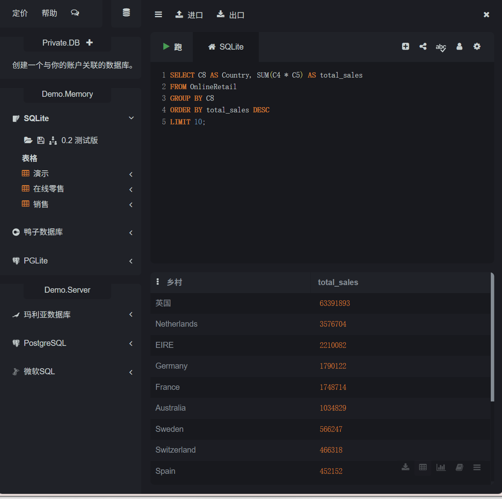

# 数据分析项目 - 电商销售分析

## 项目目的
为产品数据分析实习准备的练习项目。

## 数据集
Online Retail 数据集（54万行真实交易记录）

## 使用的工具
- SQLiteOnline（SQL查询）
- GitHub（代码托管）

## 分析内容
1. 各国销售额排名
2. 畅销商品排名

## SQL代码
见 `queries.sql`

## 查询结果截图

